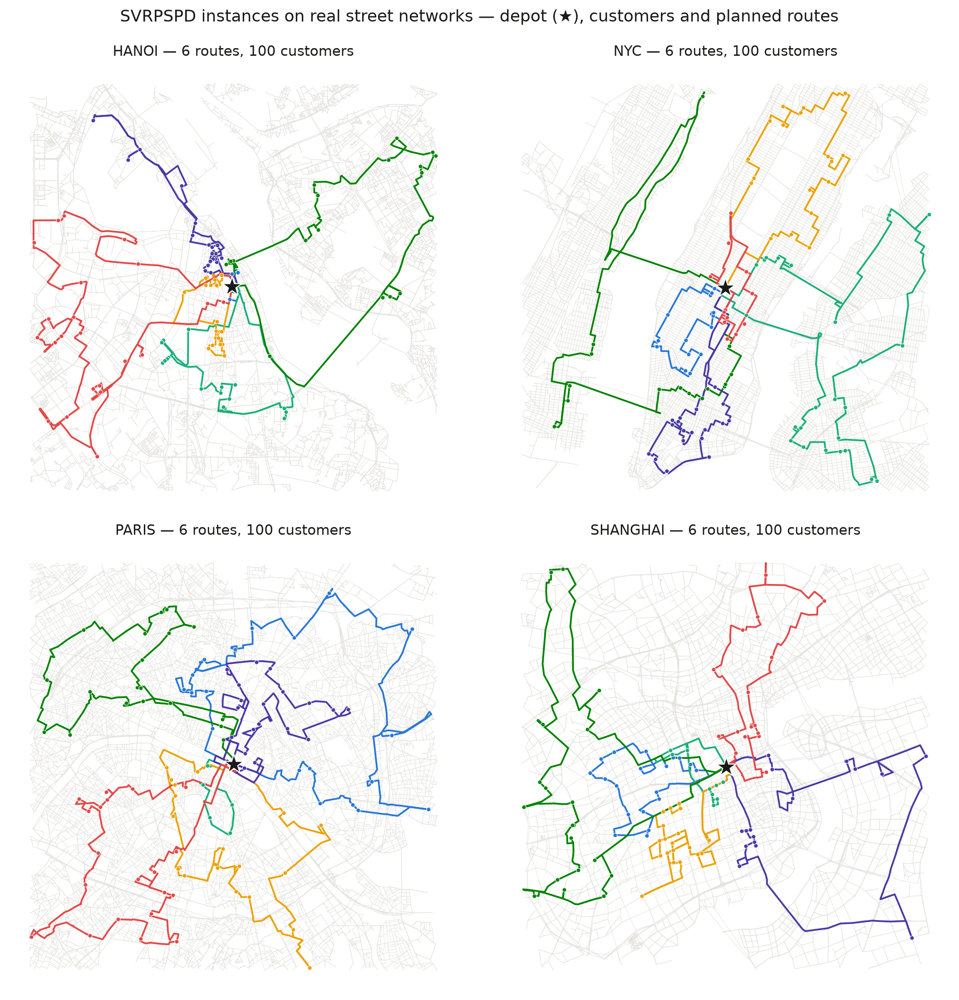

# Stochastic VRPSPD — robust planning + BATON optimal-stopping execution

[](https://www.python.org/)
[](https://opensource.org/licenses/Apache-2.0)
[](https://github.com/vinhqdang/stochastic_vrp)

## Overview

Research codebase for the **Vehicle Routing Problem with Simultaneous Pickup
and Delivery under Stochastic Demand (SVRPSPD)**, covering both decision
layers of a last-mile operation:

| Layer | What it does | Where |
|---|---|---|
| **Planning** | ALNS route construction under six capacity-feasibility gates: deterministic, SAA-CVaR, Wasserstein-DRO, and three published robust baselines (Gounaris quadrant-budget, Bertsimas–Sim budget, Cantelli/moment-DRO) | `svrpspd_wdro/scripts/dethloff_runner.py` |
| **Execution** | Online mid-route **handoff** policies that watch the live load as the vehicle serves customers and decide when to dispatch a standby vehicle — headlined by **BATON** (Backward-induction AcTion pricing for ONline recourse): a peak-aware optimal-stopping policy over the full recourse action set {continue, hand off, depot-restock}, with *zero tuning parameters* | `svrpspd_wdro/core/otr2.py`, `core/costs.py` |

**Headline results** (details in [`RESULTS_OTR2.md`](RESULTS_OTR2.md)):
BATON beats its predecessor, tuned thresholds, published rule-based
recourse (Salavati-Khoshghalb et al. 2019), and an equal-data dynamic
program on **all six planning gates** (paired Wilcoxon p ≤ 8×10⁻³, mostly
≤ 10⁻⁸), reaches **92–99% of a near-exact DP** given 50× its data, and under
the three-class fleet cost model stays firmly positive (+11–13%) where
threshold policies *destroy* value (−1.4%) on conservative plans. Plans are
certified within **9.3% of optimal on average** by Gurobi MIP bounds.

## Problem

Each vehicle departs the depot preloaded with its deliveries and collects
pickups as it goes. The on-board load after customer $k$ is

$$L_k = \underbrace{\sum_{i \in \text{route}} d_i}_{L_0} - \sum_{j=1}^k d_j + \sum_{j=1}^k p_j .$$

Demands are stochastic, so the **running peak** $\max_k L_k$ is random and
may breach capacity $Q$ mid-route — an expensive emergency. The execution
problem is *when to hand the remainder of a route to a standby vehicle*:
act too early and you pay for handoffs you didn't need; too late and you
pay surge prices plus SLA compensation.

## BATON in one paragraph

Offline, from historical demand paths (empirical distribution, no
parametric assumption), backward induction fits per-stop monotone models
$\hat C_k(w)$ = *expected cost of continuing optimally past stop $k$ with
load state $w$* (Longstaff–Schwartz with isotonic regression; overflow
labelled on the running **peak**, not the endpoint — the predecessor's
defect). Online, after every stop, one comparison: **hand off iff
$\hat C_k(W_k) > H_k$**, the current per-stop handoff price. The rule
prices in option value (early in the route, waiting is cheap) and adapts
to state-dependent prices — which no single threshold $\tau$ can do.
A deliberate null result (`core/otr21.py`): enriching the statistic with
factor posteriors/recency features *loses* to the scalar-$W_k$ isotonic
models at operational data scales (23/25 routes) — the design is at the
right complexity point.

## Repository structure

```
stochastic_vrp/
├── svrpspd_wdro/        # THE maintained pipeline — see svrpspd_wdro/README.md
│   ├── core/            #   OTR-2.0/2.1, three-class cost model, DP benchmark,
│   │                    #   published pi-rules, W-DRO planner internals
│   ├── scripts/         #   evaluations, gates, instance generators, figures,
│   │                    #   trip animations, MIP certification
│   ├── data/            #   Dethloff (40x50) · Salhi-Nagy (14x50-199) · City
│   │                    #   (100-400 cust on real OSM road networks:
│   │                    #    HCMC, Hanoi, NYC, Paris, Shanghai)
│   ├── tests/           #   pytest suite (~185 tests)
│   └── results/         #   CSVs + figures (paper tables regenerate from these)
├── papers/
│   ├── baton/           # paper 1 manuscript — UNDER REVIEW at Computers & OR
│   └── tempo/           # paper 2 (TEMPO: anytime-valid re-optimization) — active
├── RESULTS_OTR2.md      # running results summary — eight experiment layers
├── legacy/              # archived ECHO-era code (not maintained)
└── requirements.txt
```

## Evaluation design

- **Execution policies compared** (11): reactive, OTR-1.0 endpoint baseline,
  myopic threshold, peak-label tuned threshold, π1/π2/π3 published recourse
  rules, **OTR-2.0**, plug-in DP at equal data, near-exact DP (50k paths),
  clairvoyant oracle.
- **Cost model** (`core/costs.py`): three vehicle classes — planned fleet
  ($35/veh-day), standby (each handoff consumes a pooled vehicle-day at
  $20 + dispatch + per-km surcharge on the *remaining* route), emergency
  (surge callout + 2.5× km + $1.5/late customer + goodwill). All policies
  score on 2,000 out-of-sample test days per route.
- **Exact-method anchors**: backward DP for the stopping stage (MIPs cannot
  encode non-anticipative multistage rules); Gurobi/HiGHS MIP bounds for the
  planning stage (Montané–Galvão two-commodity flow).

## Visualizations



- `scripts/make_figures.py` — four-city route maps, the decision-rule
  explainer (load fan, $\hat C_k$ vs $H_k$, cost bars), spike-day map replay.
- `scripts/animate_execution.py` — **animated trip replays** on the real
  street network with breadcrumb road trails and load gauges:
  `policy=compare` (reactive vs OTR-2.0, same realized demands) and
  `policy=fleet` (every vehicle of a plan simultaneously, e.g. 13 vehicles /
  200 customers in Hanoi). GIFs in `results/figures/`.

## Quick start

```bash
pip install -r requirements.txt
cd svrpspd_wdro

# grand comparison grid (Dethloff, 6 gates x 11 policies)
python scripts/run_realistic_eval.py policies=Det,SAA,WDRO,Gounaris,Cui,MDRO workers=3 out=results_grand_dethloff

# large-scale benchmarks (Salhi-Nagy 50-199 cust; real-map city 100-400 cust)
python scripts/run_realistic_eval.py dir=data/SalhiNagy policies=Det out=results_salhinagy_eval
python scripts/run_realistic_eval.py dir=data/City      policies=Det out=results_city_eval

# exact-solver certification (HiGHS default; solver=gurobi with a WLS licence)
python scripts/run_mip_cert.py dethloff tlim=300

# animation of one day (assignment + realized demand scenario)
python scripts/animate_execution.py policy=compare scenario=0
python scripts/animate_execution.py policy=fleet instance=HANOI-200-1

# tests
python -m pytest tests/ -q
```

Solved plans are cached in `results/plans/*.json`, so evaluation reruns
skip the ALNS solving stage. Full module map and per-table reproduction
commands: [`svrpspd_wdro/README.md`](svrpspd_wdro/README.md).

## Manuscript

`papers/baton/` holds the Computers & Operations Research manuscript
(optimal-stopping
formulation, three propositions with proofs, all tables generated from the
result CSVs by `papers/baton/make_tables.py`). Citations are tracked with DOIs in
`papers/baton/references.bib`; unverified entries are flagged in
`papers/baton/VERIFY_CITATIONS.md`.

## License

Apache 2.0 — see [LICENSE](LICENSE).
